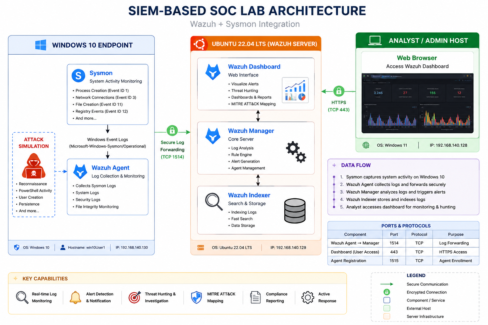
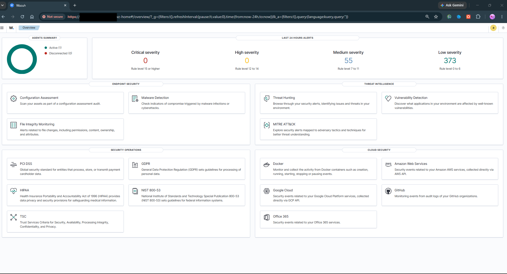
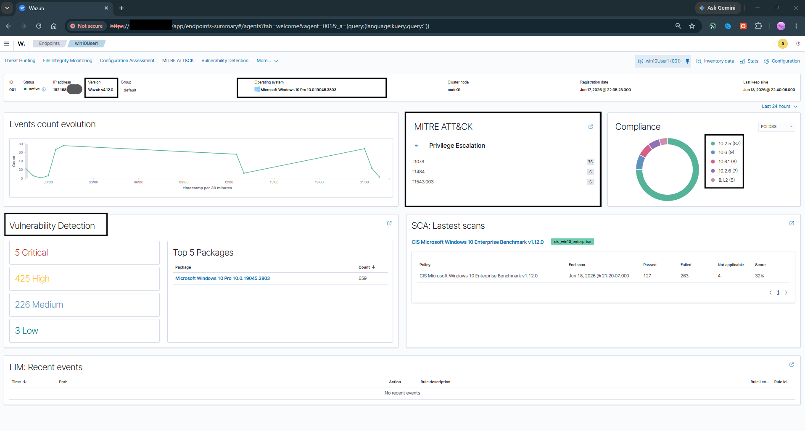
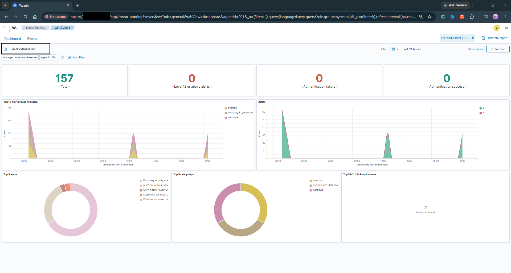

# SIEM-Based SOC Lab

## Overview

This project demonstrates a Security Operations Center (SOC) Lab built using Wazuh SIEM, Sysmon, Ubuntu Server, and Windows 10.

The lab collects Windows logs, Sysmon telemetry, and security events for centralized monitoring, threat hunting, and incident investigation.

## Architecture

## Components

* Ubuntu 22.04 LTS
* Wazuh Manager
* Wazuh Dashboard
* Wazuh Indexer
* Windows 10 Endpoint
* Wazuh Agent
* Sysmon

## Features

* Centralized Log Collection
* Sysmon Integration
* Threat Hunting
* Windows Security Monitoring
* Process Creation Detection
* User Account Monitoring
* MITRE ATT&CK Mapping

## Screenshots

### Dashboard

### Agent Connected to The Server

### Sysmon Events

## Attack Simulations

* PowerShell Execution
* Process Monitoring
* User Account Creation
* Network Reconnaissance

## Author

Rishipal Ghosh

